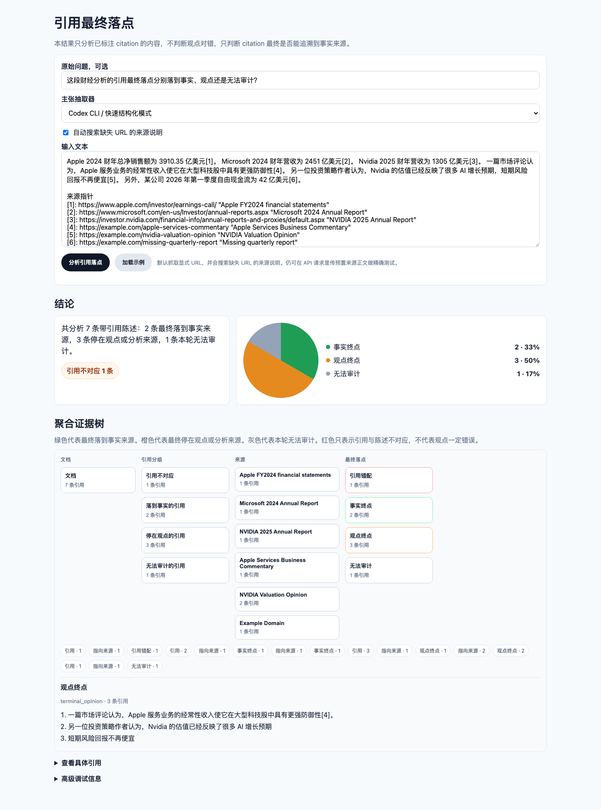

# Source Grounding Auditor

这个项目第一版是 citation terminal audit：给定带 citation 的文章或 AI 回答，统计已标注 citation 最终落到事实、观点还是无法审计。它不判断观点真假，不评价整篇文章可信度，也不输出单一可信度分数。

## About

Source Grounding Auditor 是一个引用最终落点审计工具。它面向带 citation 的文章、研究笔记和 AI 回答，把“引用是否可靠”拆成一个更具体的问题：这条 citation 最终是落到事实来源、停在观点来源、无法审计，还是和被引用陈述不对应。

项目第一版采用 citation-only mode，只分析已经标注 citation 的内容，不把未引用段落混进统计。后端保留 claim extraction、support relation、risk flags 等结构化诊断字段，但默认产品界面只展示用户真正需要的四类结果：事实终点、观点终点、无法审计和引用错配 warning。

它不判断观点本身对错，也不试图给整篇文章打一个可信度分数。它的目标是让用户快速看清一篇文章或 AI 回答的引用链最终落在哪里。

## 当前能力

- 输入 AI 回答、文章正文或带 citation 的文本。
- 默认使用 citation-only mode：只分析带 citation 的句子或段落；未带 citation 的内容不进入终点统计。
- 解析 URL、Markdown citation、脚注和参考文献 URL。
- 将每个 cited statement 的最终落点分为 FACT、OPINION、UNRESOLVED、MISMATCH。
- 主界面用饼图展示事实终点、观点终点、无法审计；引用错配作为 warning badge 单独显示。
- 输出一个聚合证据树：文档 -> 引用分组 -> 来源 -> 终点。
- 点击来源或终点节点查看具体 cited_text 列表。
- 内部仍抽取 atomic claims，并保留 claim 分类、source support relation、risk flags 等 debug 字段。
- 支持 provided_sources，用于把 citation URL 映射到用户提供的 source text。
- 默认抓取显式 URL。
- 默认搜索无 URL 的 `[1] Reuters ...` 来源说明，发现候选公开来源。
- 输出以下比例：
  - 事实终点比例
  - 观点终点比例
  - 无法审计比例
  - 引用错配数量
- 保留旧的 claim 级 API 字段用于调试和兼容。
- 提供简单 Web UI。

## Citation terminal audit

本项目第一版产品定义是 citation terminal audit。

它不判断观点真假，不评价整篇文章可信度，只统计已标注 citation 最终落到事实、观点还是无法审计。

终点分类：

- `FACT`：citation 最终落到良好定义的事实来源，例如官方页面、原始数据、法律法规、公司公告、财报、论文、报告中的具体数据、访谈原文或 transcript。
- `OPINION`：citation 最终停在观点、评论、博客、媒体分析、专家判断、投资观点、建议或价值判断，且继续追溯后没有落到事实来源。
- `UNRESOLVED`：source 不可访问、source body 缺失、citation 没有 URL、网页抓取失败，或本轮无法判断最终落点。
- `MISMATCH`：source 可访问且有相关片段，但 source 明显不支持 cited statement，或与 cited statement 矛盾。

内部 claim 分类和 support relation 只用于后端，不是用户主界面。

## Demo screenshot

下面是一段完整财经分析文本的展示结果：既有落到财报数据的事实终点，也有停在投资评论的观点终点，并保留少量无法审计和引用错配 warning。



## LLM-first structured classification

本项目使用 LLM first structured classification。启发式规则只用于 citation parsing、schema validation、fallback 和测试，不用于核心语义判断。

`risk_flag` 是底层诊断，不等于 problematic citation。`problematic_citations` 只表示 cited claims 中作者真实主张的、重要的、且证据关系存在实质问题的 citation。

`audit_limited_citations` 只表示本轮无法完成 source support check，不表示 claim 错误。`attribution_supported_citations` 表示 source 支持“某来源说过这件事”，不表示被转述内容本身已被一手事实证明。

所有比例默认都基于 cited claims，响应中的 `summary.ratios_basis` 会写明 `based only on cited claims`。预留字段 `uncited_claim_analysis_enabled` 当前默认为 `false`。

## Display layer

内部诊断标签不是用户端展示标签。`claim_type`、`discourse_role`、`support_relation`、`final_bucket`、`risk_flags` 等字段仍然保留用于 debug、测试和后续分析，但默认 UI 不直接把它们作为结果标签展示。

用户端默认状态由 `TerminalClassifier` 从结构化 claim、support、display status 和上游来源链路派生。主界面只展示事实终点、观点终点、无法审计和引用错配 warning。`claim_type`、`discourse_role`、`support_relation`、`final_bucket`、`risk_flags` 等内部字段放在高级调试信息中。

系统会生成文档级聚合证据树，结构为 `document -> citation_group -> source -> terminal_class`。相同 source 会合并成一个节点，边和节点上显示 count。旧的每条 claim 证据图仍在 API 中保留用于调试。

## 重要限制

- 当前 claim extraction 默认使用 Codex CLI 的快速结构化模式，也支持 OpenAI API。
- 当前 source support check 依赖结构化 LLM 判断，不是严格事实核查。
- 默认抓取外部网页。可在 API 请求中传 `enable_url_fetch=false` 关闭显式 URL 抓取。
- 默认搜索无 URL 的来源说明。可在 API 请求中传 `enable_web_search=false` 关闭搜索。
- 当前搜索 provider 使用 no-key DuckDuckGo HTML 搜索，搜索结果质量会影响 discovered source 的准确性。
- 追踪上游来源时，只承认 source 文本中显式出现的 URL，不根据语义相似度猜测 source edge。
- Codex/ChatGPT 订阅不能直接当作 OpenAI API key 使用；如需走订阅通道，本项目通过本机 `codex exec` 接入。

## 安装与运行

```bash
cd source_grounding_auditor
python -m venv .venv
source .venv/bin/activate
pip install -r requirements.txt
PYTHONPATH=backend uvicorn app.main:app --reload --app-dir backend
```

打开：

```text
http://127.0.0.1:8000
```

健康检查：

```bash
curl http://127.0.0.1:8000/health
```

## LLM claim extraction 测试

默认请求走 Codex CLI 的快速结构化模式。先确认本机 Codex 已登录：

```bash
codex login status
```

然后请求：

```bash
curl -X POST http://127.0.0.1:8000/analyze \
  -H 'Content-Type: application/json' \
  -d '{
    "claim_extraction_mode": "codex",
    "input_text": "OpenAI released GPT-4o in 2024, and it supports text, audio, and image inputs."
  }'
```

默认 Codex 模型是 `gpt-5.3-codex-spark`，可以用环境变量覆盖：

```bash
export CODEX_MODEL="gpt-5.3-codex-spark"
export CODEX_SERVICE_TIER="fast"  # 可选，默认 fast
export CODEX_REASONING_EFFORT="low"  # 可选，默认 low
export CODEX_TIMEOUT_SECONDS="90"  # 可选，默认 90 秒
```

如需测试 OpenAI API 抽取，先在启动后端的同一个 shell 设置 API key：

```bash
export OPENAI_API_KEY="your_api_key"
export OPENAI_MODEL="gpt-4o-mini"  # 可选
PYTHONPATH=backend uvicorn app.main:app --reload --app-dir backend
```

然后请求：

```bash
curl -X POST http://127.0.0.1:8000/analyze \
  -H 'Content-Type: application/json' \
  -d '{
    "claim_extraction_mode": "openai",
    "input_text": "OpenAI released GPT-4o in 2024, and it supports text, audio, and image inputs."
  }'
```

也可以传 `"claim_extraction_mode": "auto"`：优先使用 `OPENAI_API_KEY`，其次使用已登录的 Codex CLI。没有可用 LLM 时会返回配置错误。

## API 示例

```bash
curl -X POST http://127.0.0.1:8000/analyze \
  -H 'Content-Type: application/json' \
  -d '{
    "input_text": "The company reported revenue of $10 billion in its 2024 annual report [source](https://example.com/ar).",
    "provided_sources": [
      {
        "url": "https://example.com/ar",
        "title": "2024 annual report",
        "source_type": "primary_fact_source",
        "access_status": "accessible",
        "extracted_text": "The company reported revenue of $10 billion in its 2024 annual report."
      }
    ]
  }'
```

如果输入只有编号来源说明、没有 URL，默认会自动搜索。也可以显式传参：

```bash
curl -X POST http://127.0.0.1:8000/analyze \
  -H 'Content-Type: application/json' \
  -d '{
    "input_text": "The company reported revenue of $10 billion in its 2024 annual report [1].\n\n[1] 2024 annual report revenue $10 billion",
    "enable_web_search": true,
    "max_search_results": 2
  }'
```

搜索发现的来源会标记为 `discovered_source`。它可以参与 claim 支撑判断，但不会被当作作者原文明确引用的上游来源。

## 运行测试

```bash
cd source_grounding_auditor
PYTHONPATH=backend pytest -q backend/tests
```

## 后续接入 LLM 的位置

- `backend/app/providers/llm_provider.py`
- `backend/app/claim_extractor.py`
- `backend/app/support_checker.py`

生产版本应要求 LLM 输出符合 `backend/app/schemas.py` 中的 Pydantic schema，并在进入 analyzer 前做校验。

## 后续接入搜索的规则

搜索结果只能作为 `discovered_source`，不能自动成为真实上游来源边。只有当一个 source 文本显式链接、引用或声明依赖另一个 source 时，才能创建 `upstream_source` edge。
